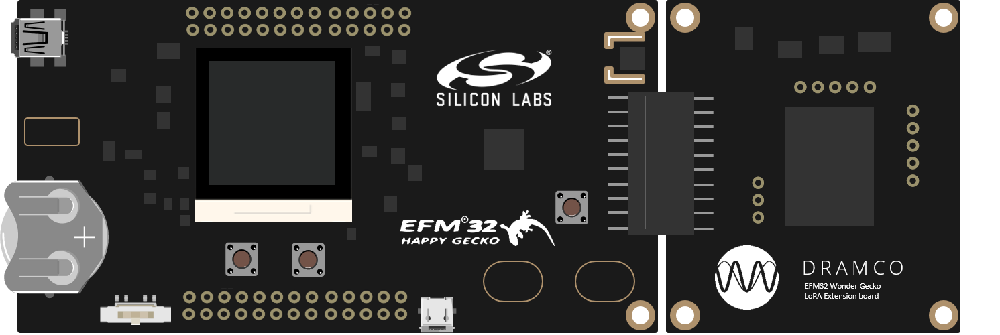

# LoRaWAN_EFM32


[](https://zenodo.org/badge/latestdoi/97035915)


LoRaMAC implementation based on the Semtech implemenation for the EFM32 Happy Gecko develop board.
Developed by [DRAMCO](http://www.dramco.be).



This project will be used in hands-on sessions to let attendees experience the development of low power IoT nodes.
The module was used in the following tutorials:
- [IEEE Sensors 2017](http://ieee-sensors2017.org/low-power-wireless-technologies-connecting-embedded-sensors-iot-journey-fundaments-hands)
- [IEEE PIMRC 2017](http://pimrc2017.ieee-pimrc.org/program/tutorials-2/)
- Workshop: [Connecting Embedded Sensors in the IoT](https://dramco.be/tutorials/connecting-embedded-sensors-in-the-iot)

The hands-on can be found [here](dramco.be/tutorials/low-power-iot) with the corresponding [presentation](https://www.slideshare.net/GillesCallebaut/low-power-wireless-technologies-for-connecting-embedded-sensors-in-the-iot-a-journey-from-fundaments-to-handson-90398582).

The DRAMCO LoRa module features a Semtech SX1272 Radio chip and an EFM32 Cortex M0 processor. 


## How to cite
```LaTex
@Misc{lorawan-efm32,
  author =   {G. Ottoy and G. Leenders and G. Callebaut},
  title =    {{LoRaWAN EFM32}},
  url = {https://github.com/DRAMCO/LoRaWAN_EFM32},
  note = {doi: \url{10.5281/zenodo.1209414}}
}
```
